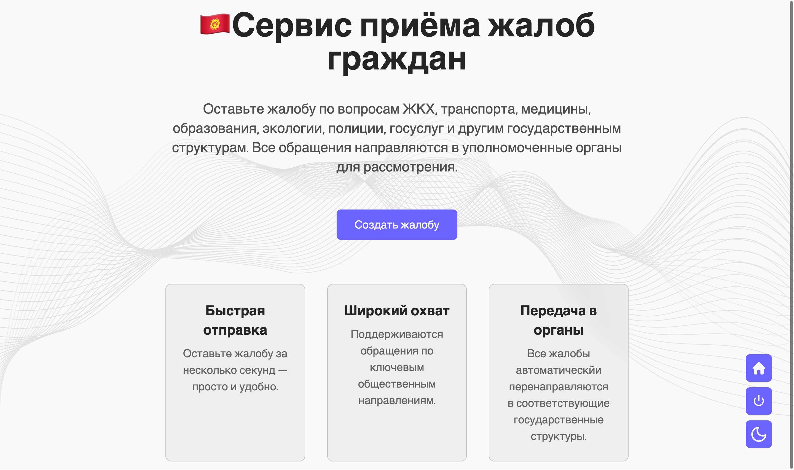
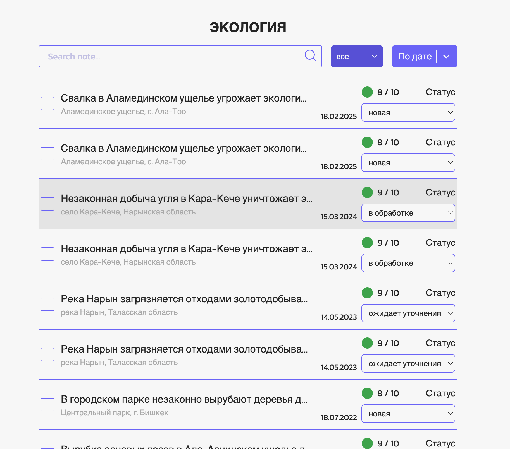
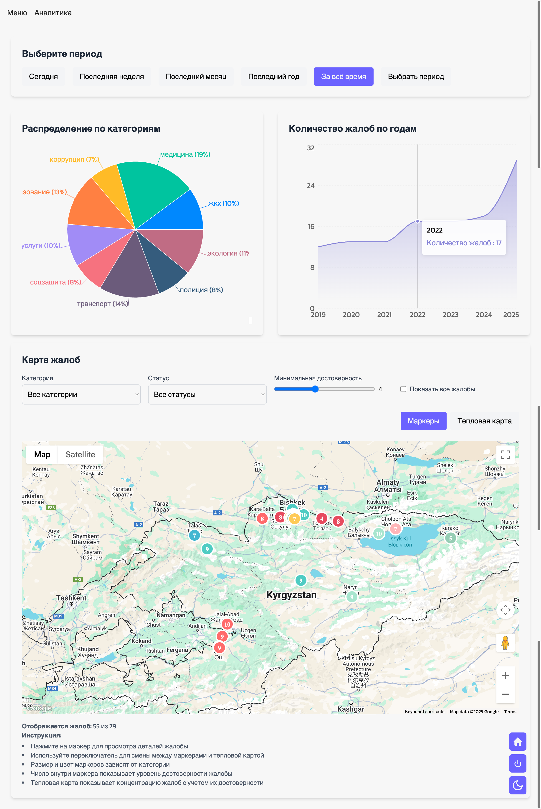

x# 🇰🇬 Система приема и обработки жалоб граждан Кыргызстана

Платформа предназначена для упрощения подачи и обработки жалоб граждан с автоматической маршрутизацией обращений в соответствующие государственные органы. Используется искусственный интеллект для оценки достоверности и категоризации жалоб.

## 🔑 Ключевые функции

### 1. Подача жалоб

- Интуитивно понятная форма отправки
- Автоматическое определение геолокации или выбор на карте
- Поддержка категорий: ЖКХ, медицина, транспорт, полиция, экология и др.  
  

### 2. Административная панель

- Разграничение доступа по ведомствам
- Система статусов: `new`, `in_progress`, `waiting`, `rejected`, `completed`
  

---

### 3. Аналитический дашборд

- Графики и диаграммы по категориям
- Динамика жалоб по времени
- Карты с геолокацией жалоб
- Тепловая карта жалоб
  

## 🛠️ Технический стек

- **Frontend**: React + TypeScript
- **State Management**: Redux Toolkit
- **UI**: TailwindCSS
- **Карты**: Google Maps API, Leaflet
- **Графики**: Recharts
- **Backend**: Node.js (Express)
- **База данных**: PostgreSQL
- **Искуственный интеллект**: Haiku3 (AWS Bedrock)
